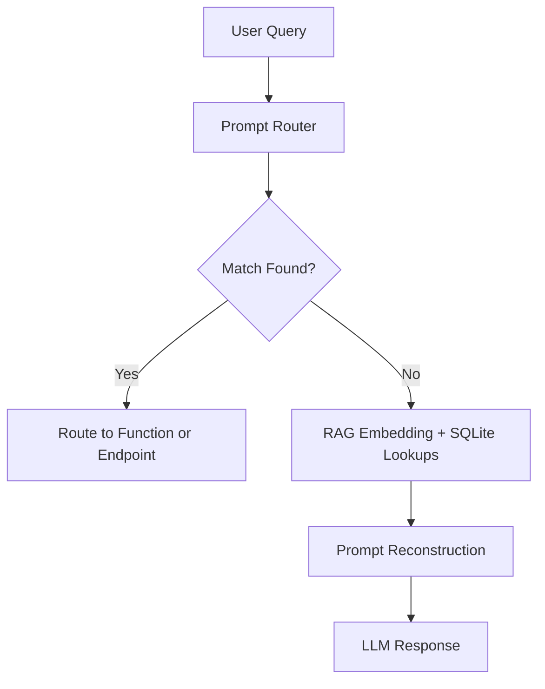

# 🏛️ Trajan Betting Central (TBC)

**Trajan Betting Central** is a Flask-powered sports trading and analytics platform that brings together professional-grade tools for bettors, traders, and line hunters. It includes EV calculators, arbitrage detection, promo evaluators, vig removal tools, and an LLM-powered chatbot assistant named Hadrian.

---

## Technologies Used

* **Backend:** Python 3, Flask
* **Database:** SQLite3
* **Frontend:** HTML/CSS/JS, Jinja2 templating
* **External APIs:** OddsAPI (raw JSON odds from bookmakers)

---

## Directory Structure (Key Files)

```
project_root/
├── static/                # CSS, JS, images
├── templates/             # HTML templates
├── allodds.txt            # Raw bookmaker dump
├── app.py                 # Flask backend
├── helpers.py             # Utility functions
├── promoeval.py           # Promo evaluator logic
├── ev_populator.py        # EV calc logic
├── arbpopulator.py        # Arbitrage finder logic
├── eventshopping.py       # Line shopping from OddsAPI
├── hadrian.py             # GPT-based assistant logic
├── database.db            # SQLite DB
└── README.md              # This file
```

---

## Core Features

### EV Calculator (`/ev_populate/`)

* Parses `allodds.txt` for H2H odds
* Converts American odds to implied probs
* Normalizes by total book to get **vig-free true odds**
* Averages across books to get true line
* Calculates EV for each bookmaker's odds:

  ```
  EV = (true_prob * payout) + ((1 - true_prob) * -100)
  ```
* Stores all bets in `evbets` table

---

### Vig Calculator (`/vig_calc/`)

* User inputs 2 odds (American)
* Converts to implied probs
* Computes vig (overround)
* Normalizes to remove vig
* Returns true odds and probabilities

---

### Arbitrage Finder (`/arbpopulator/`)

* Reads odds dump from `allodds.txt`
* For each matchup, compares all book pairs
* Looks for opposite sides with +EV arbitrage
* Computes margin:

  ```
  Margin = (Payout - Stake) / Stake
  ```
* Stores profitable arbs in `arb_lines`

---

### Event Shopping Tool (`/eventshopping/<sport_key>`)

* Fetches live odds from OddsAPI
* Populates:

  * `games`: game metadata
  * `odds`: odds per outcome
  * `bookmakers`: list of active books
* Frontend matrix:

  * Rows: games
  * Columns: books
  * Cells: odds for Home / Away / Draw

---

### Promo Evaluator

#### Casino Mode (`/promoevaluator`)

* Monte Carlo simulates using `rebate_amount`, `playthrough`, `house_edge`, etc.
* Tracks bust %, final bankroll, EV%, stddev

#### Sports Mode (`/sports_evaluator`)

* Simulates multi-day betting with rebates
* Uses adjusted odds with vig removed
* Displays win/loss chart from last 10 sims

---

### Hadrian: LLM Assistant (`/gptasker`)

GPT-4o-powered chatbot that intelligently routes queries to:

* `vig_calc()`
* `promoevaluator()`
* `sports_evaluator()`
* SQL-backed table lookups: `arb_lines`, `linefinder_table`, etc.

#### Prompt Flow:



Example prompts:

* "What’s the vig for +130 and -150?"
* "Evaluate \$50 casino promo with 10x playthrough and 10% contrib."
* "Any arbitrages right now between DraftKings and BetMGM?"

---

## Helper Functions (helpers.py)

```python
def convert_odds_to_probability(odds):
    if odds > 0:
        return 100 / (odds + 100)
    else:
        return -odds / (-odds + 100)

def probability_to_american(prob):
    if prob >= 0.5:
        return int(-100 * prob / (1 - prob))
    else:
        return int((1 - prob) / prob * 100)
```

---

## Integrations & Routes

| Route                        | Method   | Purpose                    |
| ---------------------------- | -------- | -------------------------- |
| `/ev_populate/`              | GET      | Populate EV table          |
| `/vig_calc/`                 | GET/POST | Vig calculator UI          |
| `/arbpopulator/`             | GET      | Populate arb\_lines table  |
| `/eventshopping/<sport_key>` | GET      | Fetch odds + line shop UI  |
| `/promoevaluator`            | GET/POST | Run casino promo sim       |
| `/sports_evaluator`          | POST     | Run sports rebate sim      |
| `/gptasker`                  | POST     | Hadrian assistant endpoint |

---

## Security Notes

* No user input touches raw SQL directly
* All Flask forms use validated input parsing
* Hadrian's LLM execution is constrained to safe commands/functions only

---

## Future Plans

* Add player prop scanner & middle finder
* Add CLV tracker with graph
* Expand Hadrian memory and session threading
* Add live odds WebSocket streaming

---


## 🏇 Parimutuel Betting Engine (Advanced)


```mermaid
flowchart TD
  subgraph Pooling & Clearing
    A[Ticket Sales] --> B[Total Pool (P)]
    B --> C[Total Win Liabilities: \(L = \sum_i payout_i\)]
    B --> V[House Vig (V = P − L)]
    C --> D[Net Pool for Winners (W = P − V)]
  end

  subgraph Odds Calculation
    D --> E{Compute Market Probabilities}
    E -->|Without Vig| F[Raw Odds: \(p_i = \tfrac{sales_i}{P}\)]
    E -->|With Vig| G[Impacted Odds: \(\tilde p_i = \tfrac{p_i}{1 - V/P}\)]
  end

  subgraph Vig Extraction Methods
    G --> H[Standard Margin: \(V = μP\)]
    G --> I[Shin’s Method]
    G --> J[Power’s Method]
  end

  subgraph Settlement
    H & I & J --> K[Calculate Payouts: \(W \times \tilde p_i\)]
    K --> L[Distribute Funds]
  end

  style A fill:#fdebd0,stroke:#ba4a00,stroke-width:1px
  style B fill:#d6eaf8,stroke:#1b4f72,stroke-width:1px
  style V fill:#fadbd8,stroke:#6e2c00,stroke-width:1px
  style I fill:#d1f2eb,stroke:#0e6251
  style J fill:#f5b7b1,stroke:#641e16
```

### Vig Extraction Formulas

1. **Standard Margin** (flat percentage $μ$):

   $V = μ \times P$

2. **Shin’s Method** (accounts for insider trading):

   Let raw market probabilities be $p_i$, and Shin’s ratio $z$ satisfy:

   $$
     c = \sum_i \frac{p_i}{q_i} - 1, \quad z = \frac{\sqrt{c^2 + 4c} - c}{2},
   $$

   then the extracted vig is:

   $$
     V = P \left(1 - \frac{1}{\sum_i \frac{p_i}{1 - z}}\right).
   $$

3. **Power’s Method** (risk‑sensitive take, exponent $θ>0$):

   $$
     V(θ) = P \left[ 1 - \frac{\sum_i p_i^{1+θ}}{\bigl(\sum_i p_i\bigr)^{1+θ}} \right].
   $$

* $p_i = sales_i / P$ are the raw pool fractions.
* In Shin’s, $q_i$ are implied “true” probabilities solved via maximum likelihood.
* In Power’s, $θ$ adjusts how aggressively the house margins the long‑shots vs favorites.

---

