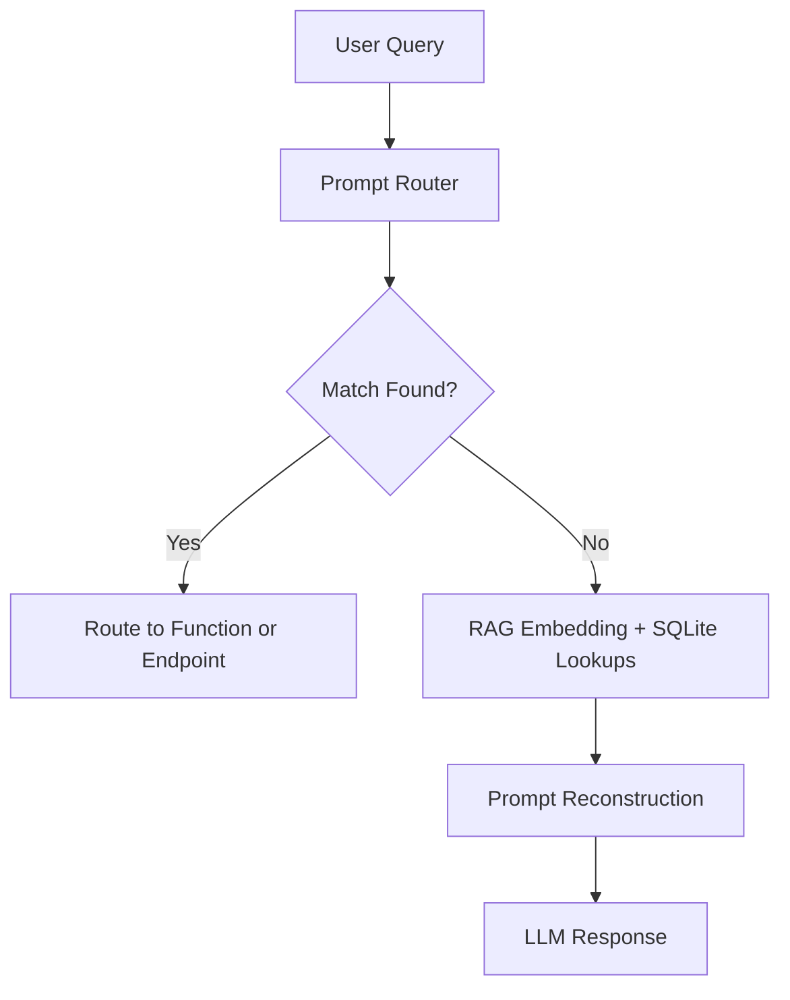
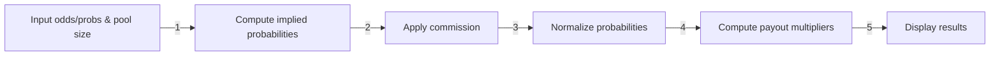

# 🏛️ Trajan Betting Central (TBC)

**Trajan Betting Central** is a Flask‑powered sports trading and analytics platform that brings together professional‑grade tools for bettors, traders, and line hunters. It includes EV calculators, arbitrage detection, promo evaluators, vig‑removal tools, and an LLM‑powered chatbot assistant named Hadrian.

---

## ⚙️ Technologies Used

* **Backend:** Python 3, Flask
* **Database:** SQLite 3
* **Frontend:** HTML/CSS/JS, Jinja2 templating
* **External APIs:** OddsAPI (raw JSON odds from bookmakers)

---

## 📁 Directory Structure (Key Files)

```text
project_root/
├── static/                # CSS, JS, images
├── templates/             # HTML templates
├── allodds.txt            # Raw bookmaker dump
├── app.py                 # Flask backend
├── helpers.py             # Utility functions
├── promoeval.py           # Promo evaluator logic
├── ev_populator.py        # EV calc logic
├── arbpopulator.py        # Arbitrage finder logic
├── eventshopping.py       # Line shopping from OddsAPI
├── hadrian.py             # GPT-based assistant logic
├── database.db            # SQLite database file
└── README.md              # This file
```

---

## 🧠 Core Features

### 📊 EV Calculator (`/ev_populate/`)

* Parses `allodds.txt` for H2H odds
* Converts American odds to implied probabilities
* Normalizes by total book to get **vig‑free true odds**
* Averages across books to get true line
* Calculates EV for each bookmaker's odds:

  ```text
  EV = (true_prob * payout) + ((1 - true_prob) * -100)
  ```
* Stores all bets in the `evbets` table

---

### 📈 Vig Calculator (`/vig_calc/`)

* User inputs two odds (American)
* Converts to implied probabilities
* Computes vig (overround)
* Normalizes to remove vig
* Returns true odds and probabilities

---

### 📊 Arbitrage Finder (`/arbpopulator/`)

* Reads odds dump from `allodds.txt`
* For each matchup, compares all book pairs
* Looks for opposite sides with +EV arbitrage
* Computes margin:

  ```text
  Margin = (Payout - Stake) / Stake
  ```
* Stores profitable arbitrages in `arb_lines`

---

### 📅 Event Shopping Tool (`/eventshopping/<sport_key>`)

* Fetches live odds from OddsAPI
* Populates:

  * `games`: game metadata
  * `odds`: odds per outcome
  * `bookmakers`: list of active books
* Frontend matrix:

  * Rows: games
  * Columns: books
  * Cells: odds for Home / Away / Draw

---

### 🎟️ Promo Evaluator

#### Casino Mode (`/promoevaluator`)

* Monte Carlo simulates using `rebate_amount`, `playthrough`, `house_edge`, etc.
* Tracks bust %, final bankroll, EV %, stddev

#### Sports Mode (`/sports_evaluator`)

* Simulates multi‑day betting with rebates
* Uses adjusted odds with vig removed
* Displays win/loss chart from last 10 simulations

---

### 🧠 Hadrian: LLM Assistant (`/gptasker`)

GPT‑4o‑powered chatbot that intelligently routes queries to:

* `vig_calc()`
* `promoevaluator()`
* `sports_evaluator()`
* SQL‑backed table lookups: `arb_lines`, `linefinder_table`, etc.

#### Prompt Flow



**Example prompts:**

* "What’s the vig for +130 and -150?"
* "Evaluate \$50 casino promo with 10× playthrough and 10% contrib."
* "Any arbitrages right now between DraftKings and BetMGM?"

---

## 🔧 Helper Functions (`helpers.py`)

```python
def convert_odds_to_probability(odds):
    if odds > 0:
        return 100 / (odds + 100)
    else:
        return -odds / (-odds + 100)

 def probability_to_american(prob):
    if prob >= 0.5:
        return int(-100 * prob / (1 - prob))
    else:
        return int((1 - prob) / prob * 100)
```

---

## 🤝 Integrations & Routes

| Route                        | Method   | Purpose                    |
| ---------------------------- | -------- | -------------------------- |
| `/ev_populate/`              | GET      | Populate EV table          |
| `/vig_calc/`                 | GET/POST | Vig calculator UI          |
| `/arbpopulator/`             | GET      | Populate `arb_lines` table |
| `/eventshopping/<sport_key>` | GET      | Fetch odds + shop UI       |
| `/promoevaluator`            | GET/POST | Run casino promo sim       |
| `/sports_evaluator`          | POST     | Run sports rebate sim      |
| `/gptasker`                  | POST     | Hadrian assistant endpoint |

---

## 🔐 Security Notes

* No user input touches raw SQL directly
* All Flask forms use validated input parsing
* Hadrian's LLM execution is constrained to safe functions only

---

## 🚀 Future Plans

* Add player prop scanner & middle finder
* Add CLV tracker with graph
* Expand Hadrian memory and session threading
* Add live odds WebSocket streaming

---

## 🎲 Parimutuel Betting Calculator

The Parimutuel Betting Calculator models payout pools where bettors share a common pool minus the house take. It supports multiple outcomes and variable commission rates.

**Workflow:**

1. **Input:** Odds or implied probabilities for each outcome, total pool size, and house commission (vig).
2. **Convert Odds to Probabilities:** Use `convert_odds_to_probability` for American lines or direct probability inputs.
3. **Adjust for Commission:** Subtract commission fraction C from total pool:

   ```text
   P_net = P_total * (1 - C)
   ```
4. **Calculate Payouts:** For each outcome i with implied prob p\_i:

   * If actual pool data N\_i is available:

     ```text
     Payout_i = P_net / N_i
     ```
   * If only probabilities, normalize:

     ```text
     p_i_tilde = p_i / sum_j p_j
     M_i = 1 / p_i_tilde
     ```

### Mermaid Flow



---

## ⚖️ Shin’s Method for Vig Extraction

This section details the **Shin method**—an advanced statistical approach to remove bookmaker vig (overround) from two‑outcome markets and recover the “true” odds.

### 1. Mathematical Derivation

Given two American odds, convert to decimal odds d1, d2 and implied raw probabilities p1, p2:

```text
d =
  if O>0: 1 + O/100
  else: 1 - 100/O
p = 1/d
```

The bookmaker’s two‑way book percentage:

```text
B = p1 + p2  # should be >1
```

Shin’s method introduces insider parameter θ:

```text
p_i_star = (B - 1 + sqrt((1 - p_i/B)^2 + 4θ p_i p_j/B^2)) / 2
θ = (B - 1 - p_min)/(p_max p_min)
```

Normalize and convert back:

```text
hat_p_i = p_i_star / (p_1_star + p_2_star)
hat_d_i = 1/hat_p_i
hat_O_i = (hat_d_i - 1)*100 if hat_d_i>=2 else -100/(hat_d_i - 1)
```

### 2. Algorithm Workflow

```mermaid
flowchart TD
  A[Input: O1, O2] --> B[Convert to d1,d2]
  B --> C[Compute p1=1/d1, p2=1/d2]
  C --> D[Compute B=p1+p2]
  D --> E[Compute θ=(B−1−p_min)/(p_max·p_min)]
  E --> F[Compute p_i_star]
  F --> G[Normalize hat_p_i]
  G --> H[Convert to hat_O_i]
  H --> I[Output: θ, hat_p_i, hat_O_i]
```
