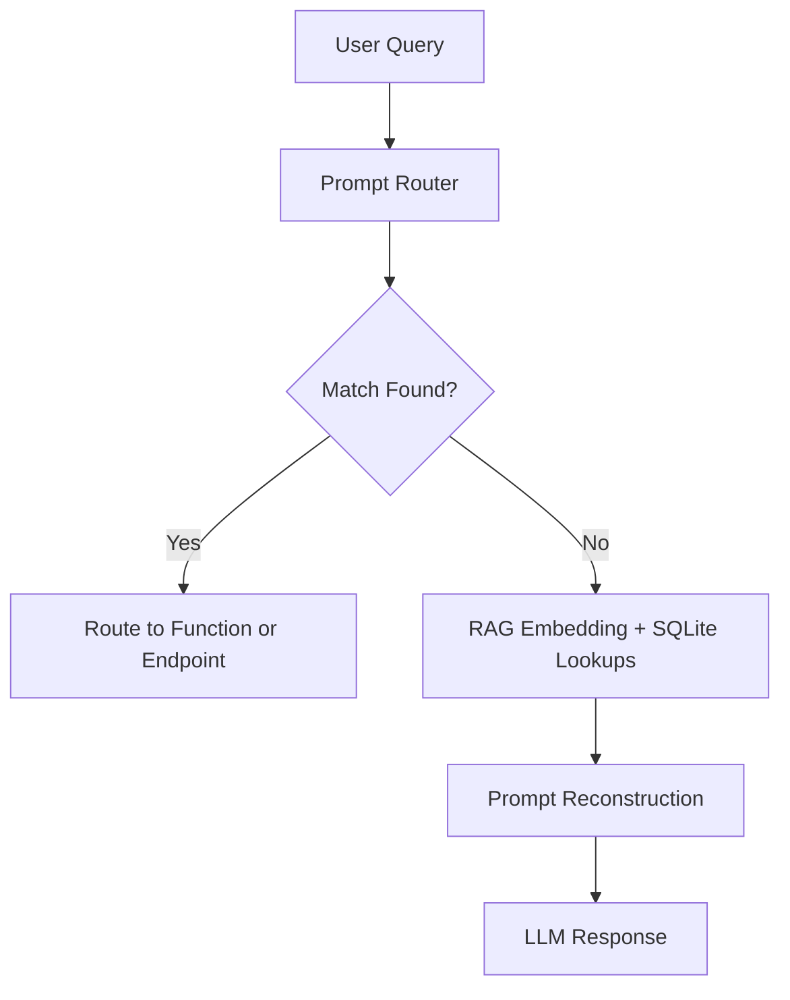
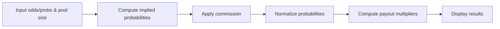

# 🏛️ Trajan Betting Central (TBC)

**Trajan Betting Central** is a Flask-powered sports trading and analytics platform that brings together professional-grade tools for bettors, traders, and line hunters. It includes EV calculators, arbitrage detection, promo evaluators, vig removal tools, and an LLM-powered chatbot assistant named Hadrian.

---

## ⚙️ Technologies Used

* **Backend:** Python 3, Flask
* **Database:** SQLite3
* **Frontend:** HTML/CSS/JS, Jinja2 templating
* **External APIs:** OddsAPI (raw JSON odds from bookmakers)

---

## 📁 Directory Structure (Key Files)

```
project_root/
├── static/                # CSS, JS, images
├── templates/             # HTML templates
├── allodds.txt            # Raw bookmaker dump
├── app.py                 # Flask backend
├── helpers.py             # Utility functions
├── promoeval.py           # Promo evaluator logic
├── ev_populator.py        # EV calc logic
├── arbpopulator.py        # Arbitrage finder logic
├── eventshopping.py       # Line shopping from OddsAPI
├── hadrian.py             # GPT-based assistant logic
├── database.db            # SQLite DB
└── README.md              # This file
```

---

## 🧠 Core Features

### 📊 EV Calculator (`/ev_populate/`)

* Parses `allodds.txt` for H2H odds
* Converts American odds to implied probs
* Normalizes by total book to get **vig-free true odds**
* Averages across books to get true line
* Calculates EV for each bookmaker's odds:

  ```
  EV = (true_prob * payout) + ((1 - true_prob) * -100)
  ```
* Stores all bets in `evbets` table

---

### 📈 Vig Calculator (`/vig_calc/`)

* User inputs 2 odds (American)
* Converts to implied probs
* Computes vig (overround)
* Normalizes to remove vig
* Returns true odds and probabilities

---

### 📊 Arbitrage Finder (`/arbpopulator/`)

* Reads odds dump from `allodds.txt`
* For each matchup, compares all book pairs
* Looks for opposite sides with +EV arbitrage
* Computes margin:

  ```
  Margin = (Payout - Stake) / Stake
  ```
* Stores profitable arbs in `arb_lines`

---

### 📅 Event Shopping Tool (`/eventshopping/<sport_key>`)

* Fetches live odds from OddsAPI
* Populates:

  * `games`: game metadata
  * `odds`: odds per outcome
  * `bookmakers`: list of active books
* Frontend matrix:

  * Rows: games
  * Columns: books
  * Cells: odds for Home / Away / Draw

---

### 🎟️ Promo Evaluator

#### Casino Mode (`/promoevaluator`)

* Monte Carlo simulates using `rebate_amount`, `playthrough`, `house_edge`, etc.
* Tracks bust %, final bankroll, EV%, stddev

#### Sports Mode (`/sports_evaluator`)

* Simulates multi-day betting with rebates
* Uses adjusted odds with vig removed
* Displays win/loss chart from last 10 sims

---

### 🧠 Hadrian: LLM Assistant (`/gptasker`)

GPT-4o-powered chatbot that intelligently routes queries to:

* `vig_calc()`
* `promoevaluator()`
* `sports_evaluator()`
* SQL-backed table lookups: `arb_lines`, `linefinder_table`, etc.

#### Prompt Flow:



Example prompts:

* "What’s the vig for +130 and -150?"
* "Evaluate \$50 casino promo with 10x playthrough and 10% contrib."
* "Any arbitrages right now between DraftKings and BetMGM?"

---

## 🔧 Helper Functions (helpers.py)

```python
def convert_odds_to_probability(odds):
    if odds > 0:
        return 100 / (odds + 100)
    else:
        return -odds / (-odds + 100)

def probability_to_american(prob):
    if prob >= 0.5:
        return int(-100 * prob / (1 - prob))
    else:
        return int((1 - prob) / prob * 100)
```

---

## 🤝 Integrations & Routes

| Route                        | Method   | Purpose                    |
| ---------------------------- | -------- | -------------------------- |
| `/ev_populate/`              | GET      | Populate EV table          |
| `/vig_calc/`                 | GET/POST | Vig calculator UI          |
| `/arbpopulator/`             | GET      | Populate arb\_lines table  |
| `/eventshopping/<sport_key>` | GET      | Fetch odds + line shop UI  |
| `/promoevaluator`            | GET/POST | Run casino promo sim       |
| `/sports_evaluator`          | POST     | Run sports rebate sim      |
| `/gptasker`                  | POST     | Hadrian assistant endpoint |

---

## 🔐 Security Notes

* No user input touches raw SQL directly
* All Flask forms use validated input parsing
* Hadrian's LLM execution is constrained to safe commands/functions only

---

## 🚀 Future Plans

* Add player prop scanner & middle finder
* Add CLV tracker with graph
* Expand Hadrian memory and session threading
* Add live odds WebSocket streaming

---

## 🎲 Parimutuel Betting Calculator

The Parimutuel Betting Calculator models payout pools where bettors share a common pool minus the house take. It supports multiple outcomes and variable commission rates.

**Workflow:**

1. **Input:** Odds or implied probabilities for each outcome, total pool size, and house commission (vig).
2. **Convert Odds to Probabilities:** Use `convert_odds_to_probability` for each American line or direct probability input.
3. **Adjust for Commission:** Subtract commission fraction C from total pool:

   ```math
   P_{net} = P_{total} \times (1 - C)
   ```
4. **Calculate Payouts:** For each outcome *i* with implied prob *p\_i*:

   * If actual pool data *N\_i* is available,

     ```math
     Payout_i = \frac{P_{net}}{N_i}
     ```
   * If only probabilities, normalize:

     ```math
     \tilde{p}_i = \frac{p_i}{\sum_j p_j} \quad,
     M_i = \frac{1}{\tilde{p}_i}
     ```

### Mermaid Flow:



### Vig Extraction Methods Comparison

| Method          | Description                                      | Formula                                                                      |
| --------------- | ------------------------------------------------ | ---------------------------------------------------------------------------- |
| **Pro-Rata**    | Scale by total book                              | p\_i^\* = p\_i / (\sum\_j p\_j)                                              |
| **Subtraction** | Subtract equal share of vig before normalization | p\_i^\* = (p\_i - V/n) / \sum\_k(p\_k - V/n)                                 |
| **Power**       | Apply exponent α to adjust skew                  | p\_i^\* = p\_i^α / \sum\_j(p\_j^α), choose α such that \sum p\_i^\* = 1      |
| **Shin**        | Bayesian Shin method using insider model         | p\_i^\* = (√(p\_i² + 4λp\_i(1-p\_i)) - p\_i)/(2λ), λ solves \sum p\_i^\* = 1 |

---

# ⚖️ Shin’s Method for Vig Extraction

This document details the **Shin method**—an advanced statistical approach to remove bookmaker vig (overround) from two-outcome markets and recover the “true” odds. It covers:

1. Mathematical derivation  
2. Step‑by‑step algorithm workflow  
3. Reference Python implementation  
4. Comparison to alternative methods (subtraction & power)  
5. Mermaid diagram of the processing pipeline  

---

## 1. Mathematical Derivation

Given two American odds, convert to decimal odds \(d_1, d_2\) and implied raw probabilities \(p_1, p_2\):

\[
d = 
\begin{cases}
1 + \frac{O}{100}, & O > 0\\[6pt]
1 - \frac{100}{O}, & O < 0
\end{cases}
\quad\Longrightarrow\quad
p = \frac{1}{d}
\]

The bookmaker’s two‑way book percentage:
\[
B = p_1 + p_2 \;>\; 1
\]

Shin’s method models insider trading (parameter \(\theta\)) such that:
\[
p_i^* \;=\; \frac{B - 1 + \sqrt{(1 - p_i/B)^2 + 4\theta\,p_i\,p_j/B^2}}{2}\quad (i\neq j)
\]
and solves for \(\theta\) from:
\[
\theta = \frac{B - 1 - p_{\min}}{p_{\max}\,p_{\min}}
\]
where \(p_{\max} = \max(p_1,p_2)\), \(p_{\min} = \min(p_1,p_2)\).

The **vig‑free probabilities**:
\[
\pi_i = p_i^* \quad\text{normalized:}\quad
\hat p_i = \frac{\pi_i}{\pi_1 + \pi_2}
\]

Convert back to American odds:
\[
\hat d_i = \frac{1}{\hat p_i}
\quad\Longrightarrow\quad
\hat O_i =
\begin{cases}
100(\hat d_i - 1), & \hat d_i\ge 2\\[4pt]
-\frac{100}{\hat d_i - 1}, & 1<\hat d_i<2
\end{cases}
\]

---

## 2. Algorithm Workflow

```mermaid
flowchart TD
    A[Input: O₁, O₂] --> B[Convert to decimal odds d₁,d₂]
    B --> C[Compute raw probs p₁=1/d₁, p₂=1/d₂]
    C --> D[Compute book B=p₁+p₂]
    D --> E[Solve θ via θ = (B−1−p_min)/(p_max·p_min)]
    E --> F[Compute Shin‐adjusted π₁,π₂]
    F --> G[Normalize: ħpᵢ = πᵢ/(π₁+π₂)]
    G --> H[Convert ħpᵢ → decimal odds ħdᵢ]
    H --> I[Convert ħdᵢ → American odds ħOᵢ]
    I --> J[Output: θ, ħp₁, ħp₂, ħO₁, ħO₂]
